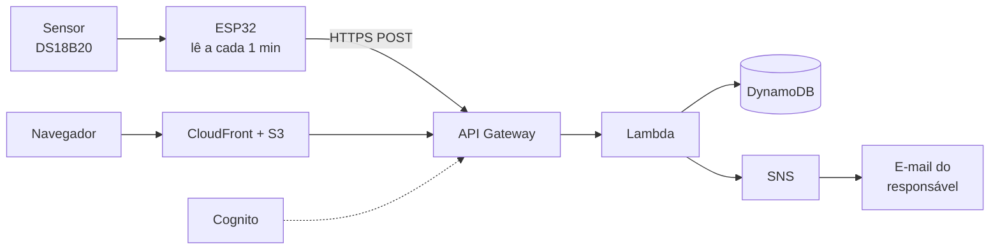

# web-2026-2-LeticiaVieira

# MonitorAgro

Monitoramento remoto de equipamentos críticos da UFERSA (freezers, câmaras frias, bombas e estufas) usando uma arquitetura serverless na AWS que custa cerca de **US$ 1 por mês**.

Sensores enviam leituras por HTTPS, a nuvem grava o histórico, avalia limites e dispara um e-mail quando algo sai da faixa aceitável. O responsável acompanha tudo por uma página web no computador ou no celular.

> Projeto da disciplina **Computação em Nuvem aplicada a Sistemas Inteligentes de Automação** — UFERSA, 2026.2


---

## O problema

Equipamentos que guardam amostras de pesquisa ou sustentam aulas práticas na UFERSA são acompanhados hoje por anotação manual em planilha, quando são acompanhados. Uma falha na sexta à noite só é descoberta na segunda-feira, e o prejuízo já aconteceu: amostras perdidas, lote descartado, compressor queimado.

O MonitorAgro resolve isso com o mínimo de infraestrutura possível.

## Como funciona



1. O ESP32 lê o sensor a cada minuto e envia um JSON por HTTPS.
2. A Lambda valida a leitura, grava no DynamoDB e compara com os limites do sensor.
3. Se o valor ficar fora da faixa por três leituras seguidas, abre um alerta e envia e-mail.
4. O usuário faz login e vê o valor atual, o gráfico das últimas 24 h e os alertas abertos.

## Stack

| Camada | Tecnologia |
|---|---|
| Dispositivo | ESP32 (MicroPython) ou Raspberry Pi (Python) |
| API | Amazon API Gateway (HTTP API) |
| Aplicação | AWS Lambda — Python 3.12 |
| Banco | Amazon DynamoDB (tabela única, sob demanda, TTL) |
| Alertas | Amazon SNS (e-mail) |
| Front-end | React + Vite + Recharts |
| Hospedagem | Amazon S3 + CloudFront |
| Autenticação | Amazon Cognito (User Pool com grupos) |
| Infraestrutura | Terraform |
| CI/CD | GitHub Actions com credenciais temporárias por OIDC |

Sem VPC, sem NAT Gateway, sem load balancer, sem instância de banco ligada 24 h. São exatamente esses itens que encarecem contas AWS pequenas.

## Estrutura do repositório

```
.
├── backend/          # Funções Lambda, regras de negócio e testes
├── frontend/         # Aplicação React
├── infra/            # Terraform de toda a infraestrutura
├── device/           # Firmware do ESP32 e script do Raspberry Pi
├── simulator/        # Gerador de leituras para desenvolver sem hardware
├── docs/             # Especificação, diagramas e estimativa de custos
└── .github/workflows # Testes e deploy
```

## Rodando localmente

Pré-requisitos: Python 3.12, Node.js 20, Terraform 1.7+ e AWS CLI configurado.

```bash
git clone https://github.com/<ORG-DA-DISCIPLINA>/web-2026-2-SEUNOME.git
cd web-2026-2-SEUNOME
```

**Backend**

```bash
cd backend
python -m venv .venv && source .venv/bin/activate
pip install -r requirements.txt
pytest                    # roda os testes das regras de negócio
```

**Front-end**

```bash
cd frontend
npm install
cp .env.example .env      # preencha a URL da API e os dados do Cognito
npm run dev               # http://localhost:5173
```

**Simulador** — gera leituras realistas, inclusive falhas, sem precisar do hardware:

```bash
cd simulator
python simulador.py --sensores 5 --intervalo 60 --api $API_URL --chave $DEVICE_KEY
python simulador.py --falha deriva      # simula sensor derivando
python simulador.py --falha silencio    # simula perda de comunicação
```

## Implantando na AWS

> **Antes de tudo:** crie um alarme no AWS Budgets em US$ 3. Leva dois minutos e evita surpresa na fatura.

```bash
cd infra
cp terraform.tfvars.example terraform.tfvars   # ajuste região, e-mail de alerta e prefixo
terraform init
terraform plan
terraform apply
```

O `apply` cria a tabela, as funções, a API, o bucket, a distribuição e o User Pool. Ao final, os `outputs` trazem a URL da API e a URL do site.

Depois, publique o front-end:

```bash
cd frontend && npm run build
aws s3 sync dist/ s3://$(terraform -chdir=../infra output -raw site_bucket)
```

Para destruir tudo e zerar o custo: `terraform destroy`.

## API

| Método e rota | Auth | Descrição |
|---|---|---|
| `POST /leituras` | Chave de dispositivo | Recebe uma ou várias leituras |
| `GET /painel` | JWT | Estado atual dos equipamentos autorizados |
| `GET /equipamentos/{id}/historico` | JWT | Série de leituras por período |
| `GET /alertas` | JWT | Lista com filtros |
| `POST /alertas/{id}/reconhecer` | JWT | Reconhece o alerta com comentário |
| `POST /equipamentos` | JWT (Admin) | Cadastra equipamento |
| `POST /sensores` | JWT (Admin ou Responsável) | Cadastra sensor e limites |
| `POST /dispositivos/{id}/chave` | JWT (Admin) | Gera ou revoga chave |
| `GET /relatorios/{id}` | JWT | Gera CSV ou PDF do período |

Exemplo de envio de leitura:

```bash
curl -X POST "$API_URL/leituras" \
  -H "Content-Type: application/json" \
  -H "x-device-key: $DEVICE_KEY" \
  -d '{"sensor_id":"TT-101","valor":-78.4,"unidade":"C","ts":"2026-08-30T14:32:00Z"}'
```

Documentação completa em `docs/api.yaml` (OpenAPI).

## Perfis de usuário

| Perfil | O que pode fazer |
|---|---|
| **Administrador** | Acesso total: usuários, equipamentos, sensores e chaves de dispositivo |
| **Responsável de Equipamento** | Define limites, recebe alertas e emite relatórios dos seus equipamentos |
| **Operador** | Acompanha painéis e reconhece alertas do seu setor |
| **Visualizador** | Somente leitura, com prazo de validade obrigatório |

O perfil vem do grupo do Cognito e é verificado sempre no backend. A interface apenas esconde o que o backend já negaria.

## Custo

| Serviço | US$/mês |
|---|---|
| API Gateway | 0,28 |
| DynamoDB | 0,59 |
| S3 | 0,03 |
| Lambda, CloudFront, Cognito, SNS, CloudWatch | 0,00 (nível gratuito) |
| **Total** | **≈ 1,08** |

Premissa: 10 sensores lendo a cada minuto, 438 mil leituras por mês. Estimativa pública na calculadora AWS: **[PREENCHER URL]**

O TTL de 90 dias nas leituras brutas é o que mantém o banco pequeno e o custo estável no tempo.

## Roadmap

- [x] Especificação e estimativa de custos
- [ ] Infraestrutura em Terraform
- [ ] Ingestão de leituras e gravação
- [ ] Painel com gráfico
- [ ] Login e controle de acesso
- [ ] Cadastro de equipamentos e sensores
- [ ] Motor de regras e alerta por e-mail
- [ ] ESP32 instalado em equipamento real
- [ ] Relatório em PDF e exportação CSV

## Documentação

- [Especificação completa do projeto](docs/especificacao.md)
- [Estimativa de custos](docs/estimativa-aws.md)
- [Diagramas](docs/diagramas/)

## Contribuindo

Trabalho em ramos `feat/...` e `fix/...`, integrados a `main` por pull request. Commits no padrão [Conventional Commits](https://www.conventionalcommits.org/pt-br/). Cada requisito da especificação tem uma issue com o identificador correspondente, como `RF-12`.


## Licença

MIT. Veja [LICENSE](LICENSE).
