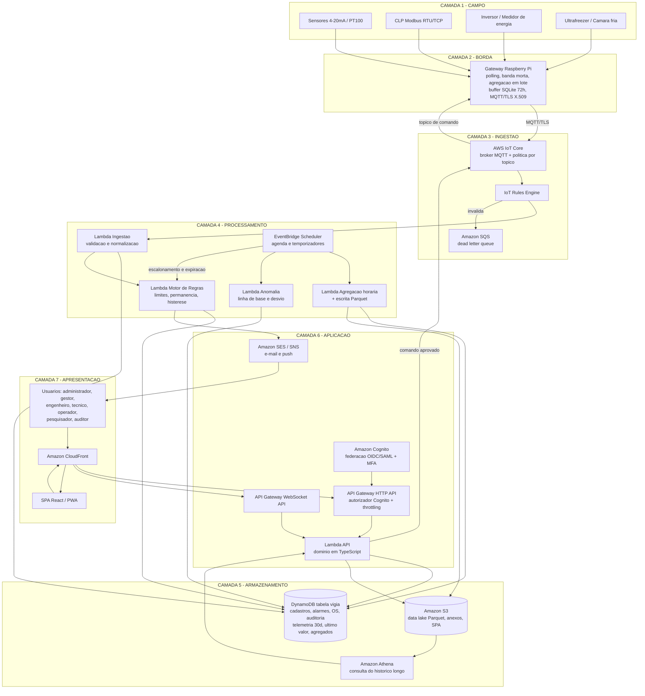

# VIGIA — Vigilância Inteligente de Grandezas Industriais e Automação

**Plataforma em nuvem para monitoramento e diagnóstico de processos industriais e tecnológicos da UFERSA**

| Campo | Conteúdo |
|---|---|
| Disciplina | Computação em Nuvem aplicada a Sistemas Inteligentes de Automação |
| Tema | Desenvolvimento de uma plataforma de monitoramento de processos industriais tecnológicos |
| Autor | Leticia Vieira |
| Matrícula | 	2026022656 |
| Repositório | web-2026-2-LeticiaVieira|
| Usuário GitHub mantenedor | LeticiaVieirg |
| Provedor de nuvem | Amazon Web Services — região `us-east-1` (N. Virginia) |
| Versão do documento | 1.0 — 30/08/2026 |

---

## Sumário

1. [Descrição do problema](#1-descrição-do-problema)
2. [Objetivos e escopo](#2-objetivos-e-escopo)
3. [Perfis de usuário e controle de acesso](#3-perfis-de-usuário-e-controle-de-acesso)
4. [Regras de negócio](#4-regras-de-negócio)
5. [Requisitos funcionais](#5-requisitos-funcionais)
6. [Requisitos não funcionais](#6-requisitos-não-funcionais)
7. [Informações armazenadas — modelo de dados](#7-informações-armazenadas--modelo-de-dados)
8. [Arquitetura do sistema](#8-arquitetura-do-sistema)
9. [Estimativa de custo da infraestrutura AWS](#9-estimativa-de-custo-da-infraestrutura-aws)
10. [Repositório e processo de desenvolvimento](#10-repositório-e-processo-de-desenvolvimento)
11. [Cronograma](#11-cronograma)
12. [Riscos](#12-riscos)
- [Apêndice A — Registro do uso de IA na elicitação de requisitos](#apêndice-a--registro-do-uso-de-ia-na-elicitação-de-requisitos)
- [Apêndice B — Glossário](#apêndice-b--glossário)

---

## 1. Descrição do problema

### 1.1 Contexto

A UFERSA opera, distribuídos entre os campi de Mossoró, Angicos, Caraúbas e Pau dos Ferros, um conjunto expressivo de **ativos eletromecânicos e processos técnicos críticos** que hoje são acompanhados de forma manual, presencial e reativa:

- **Sistemas de abastecimento de água**: poços tubulares, conjuntos motobomba, reservatórios elevados e redes de distribuição. Em uma instituição situada no semiárido, a falha silenciosa de uma bomba ou o extravasamento de um reservatório representam perda direta de um recurso escasso.
- **Sistema elétrico**: subestações abaixadoras, quadros gerais de baixa tensão e a usina fotovoltaica. A energia é uma das maiores despesas de custeio da universidade, e o consumo é conhecido apenas *a posteriori*, pela fatura mensal da concessionária.
- **Ativos de refrigeração laboratorial**: ultrafreezers (−80 °C), câmaras frias, estufas e incubadoras que armazenam material biológico, amostras de pesquisa e insumos. A perda de uma amostra por falha de refrigeração durante um fim de semana pode inviabilizar anos de trabalho.
- **Plantas didáticas de automação**: bancadas com CLPs, inversores de frequência e instrumentação dos laboratórios de Engenharia, hoje utilizadas apenas presencialmente e sem histórico de operação.

### 1.2 O problema

> **Não existe, hoje, uma visão unificada, contínua e histórica do comportamento desses processos.** O conhecimento sobre o estado dos ativos está fragmentado entre planilhas, cadernos de campo, painéis locais sem conectividade e a memória dos técnicos responsáveis.

As consequências observáveis são:

| Sintoma | Impacto |
|---|---|
| Detecção de falhas apenas quando o serviço já parou | Manutenção corretiva, indisponibilidade de água e energia, perda de amostras |
| Ausência de histórico digital de grandezas de processo | Impossibilidade de análise de tendência, de eficiência energética e de manutenção preditiva |
| Solicitações de manutenção abertas por telefone ou verbalmente | Falta de rastreabilidade, sem métrica de tempo de resposta |
| Dados de operação inacessíveis para pesquisa e ensino | Desperdício de um laboratório vivo que a própria universidade já possui |
| Contas de energia e água analisadas apenas em nível agregado | Impossível atribuir consumo a setores ou identificar desperdício localizado |

O problema se relaciona diretamente com fluxos catalogados no **Portfólio de Processos da UFERSA** (<https://ep.ufersa.edu.br/portfolio/>), em especial os macroprocessos de **Gestão de Infraestrutura e Manutenção Predial**, **Gestão de Serviços de Apoio** e **Gestão de Laboratórios**, cujas atividades de "solicitar manutenção", "executar manutenção" e "acompanhar consumo" hoje carecem de instrumentação de dados.

### 1.3 A solução proposta

O **VIGIA** é uma plataforma web multi-inquilino, integralmente *serverless*, hospedada na AWS, que:

1. **Coleta** telemetria de sensores e controladores de campo por meio de *gateways* de borda que falam Modbus RTU/TCP e OPC-UA e publicam de forma segura na nuvem via MQTT;
2. **Armazena** essas leituras em uma base operacional de baixa latência com expiração automática, complementada por um data lake permanente em formato colunar;
3. **Avalia** continuamente regras de negócio configuráveis, gerando alarmes classificados por criticidade e notificando os responsáveis;
4. **Apresenta** painéis em tempo real, gráficos históricos e relatórios de eficiência para diferentes perfis de usuário;
5. **Aprende** com o histórico, aplicando detecção de anomalia para antecipar falhas antes da parada;
6. **Fecha o ciclo** com ordens de serviço rastreáveis e, para um subconjunto controlado de ativos, comandos de atuação remota com dupla confirmação.

A plataforma é projetada sob uma restrição explícita de custo: **operar dentro de US$ 6,00 mensais**, o que a torna sustentável como projeto acadêmico e como piloto institucional sem dotação orçamentária específica.

### 1.4 Cenários motivadores

**Cenário A — Estação elevatória de água.** O sensor de nível do reservatório R-02 reporta 18 % às 03h12. A regra `nível < 20 %` dispara alarme de severidade *alta*; o VIGIA notifica por push e e-mail o técnico de plantão e registra o evento. O engenheiro, pelo celular, verifica que a corrente da bomba B-01 está 22 % acima da linha de base histórica — indício de rotor obstruído — e abre uma ordem de serviço preventiva antes que a bomba queime.

**Cenário B — Ultrafreezer de laboratório.** A temperatura do ultrafreezer UF-03 sobe de −80 °C para −68 °C ao longo de 40 minutos em um sábado. O motor de regras detecta a violação de limite *e* a taxa de variação anormal, escala a notificação em três níveis (técnico → responsável pelo laboratório → coordenador) e mantém a cadeia de custódia da temperatura exigida por protocolos de pesquisa.

**Cenário C — Eficiência energética.** O gestor consulta o painel de consumo por setor e identifica que o bloco de laboratórios mantém 40 % da carga de climatização durante a madrugada. O relatório mensal exportado subsidia uma ação de racionalização com estimativa de economia calculada sobre dados reais.

**Cenário D — Laboratório didático remoto.** Uma bancada de automação é cadastrada como planta no VIGIA. Discentes acompanham as variáveis de processo em tempo real e exportam datasets reais para trabalhos de modelagem e controle, sem precisar estar fisicamente no laboratório.

---

## 2. Objetivos e escopo

### 2.1 Objetivo geral

Desenvolver e implantar uma plataforma web em nuvem, escalável, segura e de custo operacional mínimo, para aquisição, armazenamento, análise e visualização de dados de processos industriais e tecnológicos da UFERSA, com suporte a alarmes inteligentes, manutenção preditiva e gestão de ordens de serviço.

### 2.2 Objetivos específicos

- OE1. Especificar e implementar o *firmware* de um gateway de borda capaz de ler sensores e CLPs, agregar leituras e publicar telemetria via MQTT/TLS.
- OE2. Construir uma esteira de ingestão serverless capaz de absorver picos de mensagens sem provisionamento manual.
- OE3. Modelar a persistência orientada a padrões de acesso, com camada operacional de baixa latência e camada analítica permanente.
- OE4. Implementar um motor de regras configurável pelo usuário, sem necessidade de alteração de código.
- OE5. Implementar autenticação federada e autorização baseada em papéis e atributos, com escopo por planta.
- OE6. Desenvolver a interface web responsiva com painéis em tempo real e relatórios exportáveis.
- OE7. Implementar um módulo de detecção de anomalia sobre o histórico de cada sinal.
- OE8. Automatizar a infraestrutura como código e a esteira de CI/CD.
- OE9. Manter e comprovar o custo operacional dentro do teto de US$ 6,00 mensais.

### 2.3 Escopo

**Dentro do escopo**

- Aplicação web responsiva (desktop e mobile) e API REST/WebSocket.
- Ingestão via MQTT e via HTTPS para integrações legadas.
- Cadastro de plantas, ativos, sinais, unidades de medida e limites operacionais.
- Motor de regras, alarmes, trilha de reconhecimento e escalonamento de notificações.
- Detecção de anomalia estatística sobre o histórico de cada sinal.
- Ordens de serviço vinculadas a alarmes e ativos.
- Relatórios de disponibilidade, consumo e eficiência, exportáveis em CSV e PDF.
- Comando remoto de atuação em ativos explicitamente habilitados, com dupla confirmação.
- Simulador de planta para testes sem hardware físico.
- Infraestrutura como código (Terraform) e CI/CD (GitHub Actions).
- Controle automatizado de orçamento com ação de contenção.

**Fora do escopo**

- Substituição de sistemas SCADA de segurança ou de intertravamento. O VIGIA é uma camada de supervisão e informação, **nunca** de segurança funcional.
- Controle em malha fechada em tempo real pela nuvem.
- Integração com o SIGAA/SIPAC nesta primeira versão.
- Fabricação em escala do hardware de campo; será construído apenas um protótipo de gateway.
- Aplicativo móvel nativo — a PWA responsiva atende ao caso de uso.

---

## 3. Perfis de usuário e controle de acesso

### 3.1 Perfis identificados

| # | Perfil | Quem é na UFERSA | Responsabilidade principal |
|---|---|---|---|
| P1 | **Administrador do Sistema** | Servidor da Superintendência de Tecnologia da Informação | Gerencia contas, plantas, integrações, certificados e parâmetros globais |
| P2 | **Gestor Institucional** | Pró-reitor, superintendente, diretor de campus | Visão consolidada multi-planta, indicadores, relatórios e custos. Não opera ativos |
| P3 | **Engenheiro de Processos** | Docente ou engenheiro responsável técnico | Modela plantas e sinais, define regras e limites, aprova comandos de atuação, analisa históricos |
| P4 | **Técnico de Campo** | Técnico-administrativo da manutenção | Recebe e reconhece alarmes, executa e encerra ordens de serviço, registra evidências, calibra sensores |
| P5 | **Operador** | Servidor ou bolsista de plantão | Acompanha painéis, reconhece alarmes de baixa severidade, registra ocorrências. Sem poder de configuração |
| P6 | **Pesquisador / Discente** | Docente pesquisador, aluno de graduação ou pós | Consulta e exporta séries históricas das plantas às quais foi vinculado. Somente leitura |
| P7 | **Auditor / Externo** | Concessionária, fornecedor em garantia, órgão de controle | Acesso somente leitura, temporário e restrito a um escopo previamente autorizado |
| P8 | **Dispositivo (identidade não humana)** | Gateway de borda | Publica telemetria e consome comandos. Autentica por certificado X.509, nunca por senha |

### 3.2 Matriz de permissões

Legenda: **C** criar · **L** ler · **A** atualizar · **E** excluir · **X** ação específica · **—** sem acesso

| Recurso | P1 Admin | P2 Gestor | P3 Engenheiro | P4 Técnico | P5 Operador | P6 Pesquisador | P7 Auditor |
|---|---|---|---|---|---|---|---|
| Usuários e papéis | C L A E | — | — | — | — | — | — |
| Plantas | C L A E | L | C L A | L | L | L | L |
| Ativos e sinais | C L A E | L | C L A E | L | L | L | L |
| Gateways e certificados | C L A E | — | L | L | — | — | — |
| Telemetria em tempo real | L | L | L | L | L | L | L |
| Histórico e exportação | L | L | L | L | L | L | L (limitada) |
| Regras e limites | L | L | C L A E | — | — | — | — |
| Alarmes — visualizar | L | L | L | L | L | L | L |
| Alarmes — reconhecer | X | — | X | X | X (sev. baixa) | — | — |
| Alarmes — suprimir | X | — | X | — | — | — | — |
| Ordens de serviço | L | L | C L A | C L A X (executar) | C L | — | — |
| Comando de atuação | — | — | X (aprovar) | X (solicitar) | — | — | — |
| Relatórios gerenciais | L | L | L | L | — | L | L (limitada) |
| Trilha de auditoria | L | L | L (sua planta) | — | — | — | L |
| Configurações globais | C L A E | — | — | — | — | — | — |

> **Segregação de funções.** O Administrador do Sistema não pode aprovar comandos de atuação, e o Engenheiro não pode criar usuários. Isso evita que um único perfil concentre poder de configuração e de operação sobre o processo físico.

### 3.3 Modelo de controle de acesso

O VIGIA combina três mecanismos.

**a) RBAC — controle baseado em papéis.** Cada usuário recebe um ou mais papéis (P1–P7), materializados como grupos no Amazon Cognito e propagados no token JWT na claim `cognito:groups`.

**b) ABAC — controle baseado em atributos.** O papel define *o que* o usuário pode fazer; os atributos definem *onde*. O vínculo usuário–planta é injetado no token como escopo:

```json
{
  "sub": "9f2c...",
  "email": "tecnico@ufersa.edu.br",
  "cognito:groups": ["TECNICO_CAMPO"],
  "custom:tenant": "UFERSA",
  "custom:campus": "MOSSORO",
  "custom:plantas": "PLT-001,PLT-004,PLT-009",
  "custom:mfa": "true",
  "exp": 1780000000
}
```

O isolamento entre plantas é aplicado em **duas camadas independentes**:

1. **Camada de domínio.** Toda consulta é filtrada pelo conjunto de plantas do token antes de chegar à persistência.
2. **Camada de infraestrutura.** As chaves de partição do banco começam pelo identificador de tenant e de planta, e a política IAM da função de execução usa a condição `dynamodb:LeadingKeys` para restringir fisicamente quais partições podem ser lidas. Uma falha na camada de aplicação não é suficiente, sozinha, para vazar dados de outra planta.

**c) Autenticação de máquina.** Gateways não usam usuário e senha. Cada dispositivo possui um certificado X.509 único emitido pelo AWS IoT Core, com política que restringe a publicação apenas ao tópico `vigia/{tenant}/{plantaId}/{gatewayId}/telemetry` e a assinatura apenas ao tópico de comandos correspondente. A revogação do certificado desconecta o dispositivo imediatamente.

**Demais controles**

- MFA obrigatório para os perfis P1, P2 e P3; opcional e recomendado para os demais.
- Login institucional federado (SAML/OIDC) com o provedor de identidade da UFERSA; contas locais apenas para usuários externos.
- Sessão expira em 30 minutos de inatividade; token de acesso com validade de 15 minutos e *refresh token* de 8 horas.
- Acesso de perfil P7 possui obrigatoriamente data de expiração; a conta é desativada automaticamente no vencimento.
- Limitação de taxa por usuário autenticado no gateway de API, com cota diária por conta.
- Toda ação de escrita, reconhecimento de alarme, exportação de dados e comando de atuação é registrada na trilha de auditoria com usuário, IP, carimbo de tempo e valores anterior e posterior.

---

## 4. Regras de negócio

| ID | Regra |
|---|---|
| RN01 | Um sinal pertence a exatamente um ativo, e um ativo pertence a exatamente uma planta. Plantas pertencem a um campus. |
| RN02 | Toda leitura deve conter carimbo de tempo de origem (gerado no gateway) e de recepção (gerado na nuvem). Divergência superior a 5 minutos marca a leitura com a flag `clock_drift`. |
| RN03 | Leituras com carimbo de tempo futuro superior a 2 minutos são rejeitadas e registradas na fila de mensagens mortas. |
| RN04 | Leituras duplicadas (mesmo gateway, mesmo carimbo de tempo) são idempotentes: a segunda ocorrência é descartada por escrita condicional. |
| RN05 | Um sinal sem leitura por período superior a 3× seu intervalo de amostragem entra em estado `STALE` e gera alarme de severidade média. |
| RN06 | Cada sinal possui quatro limites opcionais: LL (muito baixo), L (baixo), H (alto), HH (muito alto). LL < L < H < HH deve ser sempre verdadeiro; a gravação é rejeitada caso contrário. |
| RN07 | Um alarme só é disparado após a condição permanecer verdadeira por um tempo de permanência configurável (padrão 30 s), evitando ruído de instrumentação. |
| RN08 | Alarmes possuem histerese configurável (padrão 2 % do fundo de escala) para normalização, evitando oscilação de estado. |
| RN09 | Severidades permitidas: `INFO`, `BAIXA`, `MEDIA`, `ALTA`, `CRITICA`. Apenas `ALTA` e `CRITICA` disparam escalonamento. |
| RN10 | Escalonamento: se um alarme `CRITICA` não for reconhecido em 10 minutos, notifica o segundo nível; em 30 minutos, o terceiro nível. |
| RN11 | Um alarme reconhecido não pode ser reaberto; a recorrência da condição gera um novo alarme vinculado ao anterior. |
| RN12 | Alarme `CRITICA` gera automaticamente uma ordem de serviço em estado `ABERTA`. |
| RN13 | Ordens de serviço seguem o fluxo `ABERTA → ATRIBUIDA → EM_EXECUCAO → CONCLUIDA → VALIDADA`, admitindo `CANCELADA` a partir de qualquer estado anterior a `CONCLUIDA`. Transições fora dessa máquina são rejeitadas. |
| RN14 | Uma ordem de serviço só passa a `VALIDADA` por usuário distinto daquele que a concluiu. |
| RN15 | Comando de atuação exige *solicitação* por um perfil e *aprovação* por outro, com janela de expiração de 5 minutos. |
| RN16 | Comandos de atuação são bloqueados se o ativo estiver em alarme `CRITICA` ou em manutenção, salvo comando explícito de parada de emergência. |
| RN17 | Ativos em modo `MANUTENCAO` têm alarmes suprimidos, mas a telemetria continua sendo gravada e sinalizada como período de manutenção. |
| RN18 | Um sensor com calibração vencida marca todas as suas leituras com qualidade `SUSPEITA`; leituras suspeitas não alimentam relatórios oficiais nem o treinamento de modelos. |
| RN19 | Retenção em três camadas: dados brutos por 30 dias na base operacional, com expiração automática; agregados horários por 400 dias; histórico bruto completo arquivado permanentemente em formato colunar particionado. |
| RN20 | Exportações acima de 100 mil registros são processadas de forma assíncrona e entregues por link temporário com validade de 24 horas. |
| RN21 | Um usuário só enxerga dados de plantas às quais está explicitamente vinculado; o perfil Gestor Institucional recebe vínculo automático a todas as plantas de seu campus. |
| RN22 | Modelos de detecção de anomalia exigem no mínimo 14 dias de histórico válido do sinal para serem ativados. |
| RN23 | Nenhuma regra do VIGIA substitui intertravamento de segurança de campo; a plataforma exibe esse aviso na tela de configuração de regras. |
| RN24 | Dados pessoais tratados (nome, e-mail institucional, matrícula, registros de acesso) limitam-se ao necessário para operação e auditoria, em conformidade com a LGPD; a base legal é o exercício de atribuições legais da instituição. |
| RN25 | Um gateway com certificado revogado ou com falha de autenticação em 3 tentativas consecutivas é colocado em quarentena e requer reprovisionamento por um Administrador. |
| RN26 | O identificador de tenant é o prefixo obrigatório de toda chave de partição; consultas sem esse prefixo são bloqueadas pela política de acesso da própria base de dados. |
| RN27 | O gateway agrupa todos os sinais lidos em um único lote por intervalo de publicação e aplica banda morta configurável, transmitindo apenas quando a variação supera o limiar do sinal. |
| RN28 | O custo mensal acumulado da conta é monitorado automaticamente; ao atingir 100 % do teto orçamentário, a criação de novos recursos é bloqueada e os responsáveis são notificados. |

---

## 5. Requisitos funcionais

### Módulo 1 — Identidade e acesso

| ID | Requisito | Prioridade |
|---|---|---|
| RF01 | Permitir autenticação por login institucional federado (OIDC/SAML) e por credenciais locais para usuários externos. | Alta |
| RF02 | Exigir segundo fator de autenticação para os perfis Administrador, Gestor e Engenheiro. | Alta |
| RF03 | Permitir ao Administrador criar, editar, desativar e reativar usuários e atribuir papéis. | Alta |
| RF04 | Permitir vincular usuários a uma ou mais plantas, definindo o escopo de visibilidade. | Alta |
| RF05 | Permitir criar acesso temporário de auditor com data de expiração automática. | Média |
| RF06 | Registrar e exibir trilha de auditoria pesquisável por usuário, recurso, ação e período. | Alta |

### Módulo 2 — Cadastro e modelagem de plantas

| ID | Requisito | Prioridade |
|---|---|---|
| RF07 | Permitir cadastrar campi, plantas, ativos e sinais em hierarquia navegável. | Alta |
| RF08 | Permitir definir por sinal: unidade de engenharia, faixa, resolução, intervalo de amostragem, banda morta e limites LL/L/H/HH. | Alta |
| RF09 | Permitir cadastrar gateways, gerar certificados X.509 e acompanhar o estado de conexão. | Alta |
| RF10 | Permitir mapear registradores Modbus/OPC-UA para sinais lógicos por meio de um perfil de dispositivo reutilizável. | Alta |
| RF11 | Permitir registrar a ficha técnica do ativo (fabricante, modelo, número de série, data de instalação, plano de manutenção). | Média |
| RF12 | Permitir registrar e alertar sobre datas de calibração de sensores. | Média |
| RF13 | Permitir importar cadastro em massa via arquivo CSV. | Baixa |

### Módulo 3 — Aquisição e ingestão

| ID | Requisito | Prioridade |
|---|---|---|
| RF14 | Receber telemetria por MQTT sobre TLS com autenticação mútua por certificado. | Alta |
| RF15 | Disponibilizar endpoint HTTPS de ingestão para equipamentos sem suporte a MQTT. | Média |
| RF16 | Validar, normalizar unidades e enriquecer cada leitura com metadados do sinal antes da persistência. | Alta |
| RF17 | Tratar leituras fora de ordem provenientes de buffer de borda após reconexão. | Alta |
| RF18 | Encaminhar mensagens inválidas para fila de mensagens mortas com motivo da rejeição, sem perda. | Alta |
| RF19 | Detectar e sinalizar sinais em estado `STALE` por ausência de atualização. | Alta |
| RF20 | Prover um simulador de planta capaz de gerar telemetria sintética realista para testes e demonstração. | Alta |
| RF21 | Consolidar leituras em agregados horários (mínimo, máximo, média, desvio, contagem) por sinal. | Alta |

### Módulo 4 — Motor de regras e alarmes

| ID | Requisito | Prioridade |
|---|---|---|
| RF22 | Permitir ao Engenheiro criar regras por interface gráfica, sem programação, combinando sinal, operador, limiar, tempo de permanência e severidade. | Alta |
| RF23 | Suportar regras compostas com operadores lógicos entre múltiplos sinais. | Média |
| RF24 | Suportar regras de taxa de variação e de desvio em relação à linha de base. | Média |
| RF25 | Gerar alarmes com severidade, mensagem, contexto e valor que originou o disparo. | Alta |
| RF26 | Permitir reconhecer alarmes com registro de usuário, horário e comentário. | Alta |
| RF27 | Notificar por e-mail e notificação push. | Alta |
| RF28 | Implementar escalonamento por níveis conforme tempo sem reconhecimento. | Alta |
| RF29 | Permitir suprimir alarmes de ativos em manutenção programada. | Média |
| RF30 | Agrupar alarmes correlacionados de um mesmo ativo para evitar tempestade de notificações. | Média |
| RF31 | Manter escala de plantão configurável, direcionando notificações ao responsável do turno. | Baixa |

### Módulo 5 — Visualização e análise

| ID | Requisito | Prioridade |
|---|---|---|
| RF32 | Exibir painel em tempo real, com atualização por WebSocket, do estado dos ativos e sinais. | Alta |
| RF33 | Exibir gráficos históricos com seleção de período, comparação entre sinais e zoom. | Alta |
| RF34 | Permitir montar painéis personalizados por usuário, com componentes arrastáveis. | Média |
| RF35 | Exibir mapa dos campi com a localização e o estado de cada planta. | Baixa |
| RF36 | Gerar relatórios de disponibilidade, consumo, MTBF e MTTR por ativo e período. | Média |
| RF37 | Exportar dados em CSV, XLSX e relatório em PDF. | Alta |
| RF38 | Disponibilizar API pública documentada (OpenAPI) para consumo dos dados por outras aplicações. | Média |

### Módulo 6 — Inteligência

| ID | Requisito | Prioridade |
|---|---|---|
| RF39 | Calcular linha de base estatística por sinal, considerando sazonalidade diária e semanal. | Média |
| RF40 | Detectar anomalias por desvio em relação à linha de base e emitir alerta preditivo. | Média |
| RF41 | Estimar tendência e projetar o momento provável de cruzamento de um limite crítico. | Baixa |
| RF42 | Exibir escore de saúde por ativo, consolidando disponibilidade, alarmes e anomalias. | Baixa |

### Módulo 7 — Manutenção e atuação

| ID | Requisito | Prioridade |
|---|---|---|
| RF43 | Criar ordens de serviço manualmente ou automaticamente a partir de alarme crítico. | Alta |
| RF44 | Gerenciar o ciclo de vida da ordem de serviço conforme a máquina de estados definida em RN13. | Alta |
| RF45 | Permitir anexar fotos e observações à execução da ordem de serviço. | Média |
| RF46 | Permitir solicitar comando de atuação, exigindo aprovação por segundo usuário e registrando o resultado. | Média |
| RF47 | Publicar o comando aprovado ao gateway e aguardar confirmação de execução, com expiração automática. | Média |

### Módulo 8 — Governança de custo

| ID | Requisito | Prioridade |
|---|---|---|
| RF48 | Exibir ao Administrador o custo acumulado do mês e a projeção de fechamento. | Média |
| RF49 | Notificar automaticamente ao atingir 50 %, 80 % e 100 % do teto orçamentário. | Alta |
| RF50 | Bloquear automaticamente a criação de novos recursos ao atingir 100 % do teto. | Alta |

---

## 6. Requisitos não funcionais

| ID | Categoria | Requisito |
|---|---|---|
| RNF01 | Desempenho | Latência da telemetria (campo → painel) inferior a 3 segundos no percentil 95. |
| RNF02 | Desempenho | Consulta de 30 dias de histórico de um sinal respondida em menos de 2 segundos. |
| RNF03 | Escalabilidade | Suportar 15 gateways e 200 sinais dentro do teto orçamentário, e escalar a 500 gateways sem alteração de arquitetura, apenas revendo o teto. |
| RNF04 | Disponibilidade | Nenhum componente de instância única no caminho crítico; a disponibilidade decorre da redundância regional nativa dos serviços gerenciados utilizados. |
| RNF05 | Resiliência | Gateway armazena localmente até 72 horas de telemetria e sincroniza após restabelecer a conexão. |
| RNF06 | Segurança | Criptografia TLS 1.2+ em trânsito e criptografia em repouso em todos os repositórios de dados. |
| RNF07 | Segurança | Nenhum segredo em código-fonte; parâmetros sensíveis armazenados em serviço dedicado de configuração e varredura de segredos na esteira de CI. |
| RNF08 | Segurança | Mitigação das 10 principais vulnerabilidades OWASP por autorização obrigatória, validação de esquema na borda e limitação de taxa por usuário. |
| RNF09 | Privacidade | Conformidade com a LGPD; dados pessoais minimizados, com política de retenção e procedimento de exclusão. |
| RNF10 | Usabilidade | Interface responsiva, utilizável em telas a partir de 360 px; conformidade com WCAG 2.1 nível AA. |
| RNF11 | Observabilidade | Logs estruturados com retenção de 7 dias, métricas de negócio e correlação por *trace id*. |
| RNF12 | Manutenibilidade | Cobertura mínima de testes automatizados de 70 % nos módulos de domínio. |
| RNF13 | Portabilidade | Lógica de domínio isolada dos serviços gerenciados pelo padrão de portas e adaptadores, permitindo substituir a persistência sem reescrever regras de negócio. |
| RNF14 | **Custo** | **O custo mensal da infraestrutura não deve ultrapassar US$ 6,00, verificado por orçamento automatizado com ação de contenção em 100 %.** |
| RNF15 | Recuperação | RPO de 15 minutos e RTO de 4 horas; backup contínuo da base operacional com retenção de 35 dias e histórico permanente no data lake. |
| RNF16 | Internacionalização | Interface em português do Brasil, com estrutura preparada para novos idiomas. |

---

## 7. Informações armazenadas — modelo de dados

### 7.1 Distribuição por repositório

| Repositório | Conteúdo | Justificativa |
|---|---|---|
| **Amazon DynamoDB** (tabela única `vigia`) | Cadastros, usuários, regras, alarmes, ordens de serviço, auditoria, telemetria dos últimos 30 dias, último valor de cada sinal e agregados horários | Latência de milissegundos, cobrança por requisição, expiração automática nativa, escalabilidade sem provisionamento |
| **Amazon S3** | Histórico bruto permanente em Parquet particionado, anexos de ordens de serviço, relatórios gerados, artefatos de modelo e a aplicação web estática | Custo mínimo por GB, durabilidade de onze noves, consulta analítica direta |
| **Amazon Cognito** | Identidades, credenciais e fatores MFA | Serviço gerenciado de identidade, sem armazenamento de senha na aplicação |
| **AWS Systems Manager Parameter Store** | Configuração da aplicação e parâmetros sensíveis | Segredos fora do código e fora do banco de dados |

### 7.2 Entidades de negócio

**CAMPUS** — `id`, `nome`, `sigla`, `cidade`, `latitude`, `longitude`, `ativo`

**PLANTA** — `id`, `campus_id`, `tenant_id`, `nome`, `codigo`, `tipo` (ABASTECIMENTO_AGUA | ENERGIA | REFRIGERACAO | DIDATICA | OUTRO), `descricao`, `localizacao`, `responsavel_id`, `status`, `criado_em`

**ATIVO** — `id`, `planta_id`, `nome`, `tag`, `tipo` (BOMBA | RESERVATORIO | MOTOR | ULTRAFREEZER | INVERSOR | QUADRO_ELETRICO | CLP | OUTRO), `fabricante`, `modelo`, `numero_serie`, `potencia_nominal`, `data_instalacao`, `estado_operacional` (NORMAL | ALARME | MANUTENCAO | INATIVO), `criticidade` (1–5), `periodicidade_manutencao_dias`, `ultima_manutencao_em`

**SINAL** — `id`, `ativo_id`, `nome`, `tag`, `grandeza` (TEMPERATURA | PRESSAO | VAZAO | NIVEL | CORRENTE | TENSAO | POTENCIA | ENERGIA | VIBRACAO | RPM | ESTADO_DIGITAL), `unidade`, `tipo_dado` (FLOAT | INT | BOOL), `faixa_min`, `faixa_max`, `casas_decimais`, `intervalo_amostragem_s`, `banda_morta`, `limite_ll`, `limite_l`, `limite_h`, `limite_hh`, `histerese_pct`, `data_ultima_calibracao`, `validade_calibracao_dias`, `habilitado`

**GATEWAY** — `id`, `planta_id`, `nome`, `identificador_thing`, `certificado_arn`, `modelo_hardware`, `versao_firmware`, `endereco_mac`, `intervalo_publicacao_s`, `ultimo_heartbeat_em`, `status_conexao`, `estado` (ATIVO | QUARENTENA | DESATIVADO)

**MAPEAMENTO_PROTOCOLO** — `id`, `gateway_id`, `sinal_id`, `protocolo` (MODBUS_RTU | MODBUS_TCP | OPC_UA | ANALOGICO), `endereco_escravo`, `registrador`, `tipo_registrador`, `fator_escala`, `offset`, `ordem_bytes`

**LOTE_TELEMETRIA** — `gateway_id`, `ts_origem`, `ts_recepcao`, `sequencia`, `versao_firmware`, `leituras[]` (cada uma com `sinal_id`, `valor`, `qualidade`, `flag_manutencao`), `ttl`

**ULTIMO_VALOR** — `sinal_id`, `valor`, `qualidade`, `ts`, `estado` (NORMAL | STALE | ALARME)

**AGREGADO_HORARIO** — `sinal_id`, `hora`, `minimo`, `maximo`, `media`, `desvio_padrao`, `contagem`, `contagem_suspeita`, `ttl`

**REGRA** — `id`, `planta_id`, `nome`, `descricao`, `expressao` (JSON), `severidade`, `tempo_permanencia_s`, `mensagem_template`, `canais_notificacao`, `habilitada`, `criada_por`, `criada_em`

**ALARME** — `id`, `regra_id`, `sinal_id`, `ativo_id`, `severidade`, `estado` (ATIVO | RECONHECIDO | NORMALIZADO | SUPRIMIDO), `valor_disparo`, `limite_violado`, `iniciado_em`, `normalizado_em`, `reconhecido_por`, `reconhecido_em`, `comentario_reconhecimento`, `nivel_escalonamento`, `alarme_origem_id`

**NOTIFICACAO** — `id`, `alarme_id`, `destinatario_id`, `canal`, `enviada_em`, `status_entrega`, `tentativas`

**ORDEM_SERVICO** — `id`, `ativo_id`, `alarme_id`, `titulo`, `descricao`, `tipo` (CORRETIVA | PREVENTIVA | PREDITIVA), `prioridade`, `estado`, `solicitante_id`, `responsavel_id`, `aberta_em`, `iniciada_em`, `concluida_em`, `validada_por`, `validada_em`, `custo_estimado`, `horas_trabalhadas`, `solucao_aplicada`

**ANEXO** — `id`, `entidade_tipo`, `entidade_id`, `nome_arquivo`, `chave_s3`, `tipo_mime`, `tamanho_bytes`, `enviado_por`, `enviado_em`

**COMANDO_ATUACAO** — `id`, `ativo_id`, `tipo_comando`, `parametros` (JSON), `solicitado_por`, `solicitado_em`, `aprovado_por`, `aprovado_em`, `expira_em`, `estado` (PENDENTE | APROVADO | ENVIADO | CONFIRMADO | FALHOU | EXPIRADO), `resposta_dispositivo`

**USUARIO** — `id`, `cognito_sub`, `nome`, `email_institucional`, `matricula`, `telefone`, `perfil_principal`, `campus_id`, `mfa_habilitado`, `expira_em`, `ativo`, `ultimo_acesso_em`

**VINCULO_USUARIO_PLANTA** — `usuario_id`, `planta_id`, `papel`, `concedido_por`, `concedido_em`

**AUDITORIA** — `id`, `usuario_id`, `acao`, `recurso_tipo`, `recurso_id`, `valor_anterior`, `valor_novo`, `endereco_ip`, `user_agent`, `ocorrido_em`

**PAINEL_PERSONALIZADO** — `id`, `usuario_id`, `nome`, `layout` (JSON), `compartilhado`, `atualizado_em`

**MODELO_ANOMALIA** — `id`, `sinal_id`, `algoritmo`, `parametros`, `caminho_artefato_s3`, `treinado_em`, `metrica_qualidade`, `ativo`

### 7.3 Projeto de tabela única no DynamoDB

Todas as entidades convivem em uma tabela `vigia`, com chave composta orientada aos padrões de acesso da aplicação. O prefixo de tenant na chave de partição é o que sustenta o isolamento previsto em RN26.

| Entidade | Chave de partição (PK) | Chave de ordenação (SK) | TTL |
|---|---|---|---|
| Campus | `T#<tenant>` | `CAMPUS#<id>` | — |
| Planta | `T#<tenant>` | `PLANTA#<id>` | — |
| Ativo | `T#<tenant>#P#<planta>` | `ATIVO#<id>` | — |
| Sinal | `T#<tenant>#P#<planta>` | `SINAL#<ativo>#<id>` | — |
| Gateway | `T#<tenant>#P#<planta>` | `GW#<id>` | — |
| Mapeamento de protocolo | `T#<tenant>#GW#<id>` | `MAP#<sinal>` | — |
| Lote de telemetria | `T#<tenant>#P#<planta>#GW#<id>` | `TLM#<iso8601>` | 30 dias |
| Último valor | `T#<tenant>#P#<planta>` | `LAST#<sinal>` | — |
| Agregado horário | `T#<tenant>#S#<sinal>` | `AGG#<yyyy-mm-ddTHH>` | 400 dias |
| Regra | `T#<tenant>#P#<planta>` | `REGRA#<id>` | — |
| Alarme | `T#<tenant>#P#<planta>` | `ALM#<iso8601>#<id>` | — |
| Notificação | `T#<tenant>#ALM#<id>` | `NOTIF#<id>` | 180 dias |
| Ordem de serviço | `T#<tenant>#P#<planta>` | `OS#<id>` | — |
| Comando de atuação | `T#<tenant>#A#<ativo>` | `CMD#<id>` | 90 dias |
| Usuário | `T#<tenant>#USER#<sub>` | `PERFIL` | — |
| Vínculo usuário–planta | `T#<tenant>#USER#<sub>` | `PLANTA#<id>` | — |
| Auditoria | `T#<tenant>#AUDIT#<yyyy-mm>` | `<iso8601>#<id>` | — |
| Painel personalizado | `T#<tenant>#USER#<sub>` | `DASH#<id>` | — |
| Modelo de anomalia | `T#<tenant>#S#<sinal>` | `MODEL#<versao>` | — |

**Índices secundários globais**

| Índice | PK | SK | Padrão de acesso atendido |
|---|---|---|---|
| GSI1 | `T#<tenant>#ALARMES#<estado>` | `SEV#<severidade>#<iso8601>` | Listar alarmes ativos de todo o tenant por severidade e recência |
| GSI2 | `T#<tenant>#OS#<estado>` | `RESP#<usuario>#<iso8601>` | Listar ordens de serviço por estado e responsável |
| GSI3 | `T#<tenant>#GW#<estado_conexao>` | `<ultimo_heartbeat>` | Identificar gateways offline |

**Padrões de acesso principais**

1. Obter todos os sinais de uma planta → `Query PK = T#..#P#..`, `SK begins_with SINAL#`
2. Obter o painel em tempo real de uma planta → `Query PK = T#..#P#..`, `SK begins_with LAST#`
3. Obter as últimas 24 h de um gateway → `Query PK = T#..#P#..#GW#..`, `SK between TLM#<t0> e TLM#<t1>`
4. Obter alarmes ativos do tenant → `Query GSI1`
5. Obter o gráfico de 30 dias de um sinal → `Query PK = T#..#S#..`, `SK begins_with AGG#`
6. Obter histórico acima de 30 dias → consulta analítica sobre o Parquet no S3

### 7.4 Estrutura do lote de telemetria

Cada gateway publica um único documento por intervalo, contendo todos os seus sinais. Essa decisão é o que mantém a plataforma dentro do teto orçamentário e está formalizada em RN27.

```json
{
  "gw": "GW-MOS-014",
  "tenant": "UFERSA",
  "planta": "PLT-001",
  "ts": "2026-08-30T14:22:00.000Z",
  "fw": "1.4.2",
  "seq": 88231,
  "readings": [
    { "tag": "PLT001.B01.CORRENTE", "v": 12.84, "q": "BOA" },
    { "tag": "PLT001.B01.ESTADO",   "v": 1,     "q": "BOA" },
    { "tag": "PLT001.R02.NIVEL",    "v": 63.10, "q": "BOA" },
    { "tag": "PLT001.R02.VAZAO",    "v": 8.42,  "q": "SUSPEITA" }
  ]
}
```

### 7.5 Política de retenção

| Camada | Granularidade | Retenção | Local | Mecanismo |
|---|---|---|---|---|
| Operacional | Lote bruto | 30 dias | DynamoDB | TTL nativo, sem custo de exclusão |
| Analítica | Agregado horário | 400 dias | DynamoDB | TTL nativo |
| Histórica | Bruto em Parquet, particionado por `ano/mes/dia/planta` | Permanente | S3 Standard, migrando para Glacier Instant Retrieval após 1 ano | Regra de ciclo de vida do bucket |

### 7.6 Classificação da informação

| Classe | Exemplos | Tratamento |
|---|---|---|
| Pública | Nome e tipo de planta, indicadores agregados de campus | Pode compor painéis públicos |
| Interna | Telemetria, alarmes, ordens de serviço | Acesso conforme escopo de planta |
| Restrita | Dados pessoais de usuários, trilha de auditoria | Acesso por perfil específico, criptografia e registro de acesso |
| Secreta | Certificados de dispositivo e parâmetros sensíveis | Apenas no Parameter Store e no IoT Core; nunca exibidos na interface |

---

## 8. Arquitetura do sistema

### 8.1 Princípio arquitetural

O VIGIA adota uma arquitetura **integralmente orientada a eventos e sem servidor**. Nenhum componente é cobrado por tempo ligado: toda a plataforma é remunerada por requisição processada, por GB armazenado ou opera dentro de nível gratuito permanente. Em repouso — sem telemetria chegando e sem usuário conectado — o custo de execução da plataforma tende a zero.

Essa escolha tem três consequências de projeto que atravessam todas as camadas:

1. **A unidade de custo é a mensagem, não o sinal.** O gateway agrega todos os sinais em um único lote por intervalo, de modo que aumentar a instrumentação de uma planta não multiplica o custo.
2. **A persistência é orientada a padrões de acesso.** As chaves são projetadas a partir das consultas que a aplicação precisa fazer, e não a partir de um modelo relacional normalizado.
3. **A elasticidade é automática e ilimitada para baixo.** Não há capacidade ociosa a ser paga durante férias, fins de semana ou períodos sem aula.

### 8.2 Visão em camadas

**Camada 1 — Campo.** Sensores (nível ultrassônico, PT100, transdutor de corrente, medidor de vazão), CLPs, inversores e ultrafreezers, conectados por Modbus RTU (RS-485), Modbus TCP, OPC-UA ou saída analógica 4–20 mA.

**Camada 2 — Borda.** Gateway baseado em Raspberry Pi (ou ESP32 para pontos simples) executando um agente Python que faz *polling* dos dispositivos, converte para o modelo canônico de sinal, aplica banda morta, agrega o lote do intervalo, armazena em buffer local SQLite e publica via MQTT sobre TLS com certificado X.509. Guarda até 72 horas offline e reenvia em ordem após reconexão.

**Camada 3 — Ingestão.** O **AWS IoT Core** recebe as conexões com autenticação mútua e política restrita por tópico. O **IoT Rules Engine** roteia cada lote para a função de ingestão e desvia mensagens malformadas para uma fila de mensagens mortas.

**Camada 4 — Processamento.** Funções **AWS Lambda** executam quatro papéis distintos:

- *Ingestão*: valida o lote conforme RN02–RN06, normaliza unidades, enriquece com metadados do sinal, grava o lote e atualiza o último valor de cada sinal em uma única transação.
- *Motor de regras*: consumida por evento, avalia as regras habilitadas da planta, aplica tempo de permanência e histerese, cria alarmes e dispara notificações.
- *Agregação*: acionada de hora em hora pelo **EventBridge Scheduler**, consolida os lotes da hora anterior em agregados estatísticos e grava o bruto correspondente em Parquet no S3.
- *API*: atende as requisições da aplicação web.

O **EventBridge Scheduler** também sustenta os temporizadores de escalonamento de alarme (RN10) e de expiração de comando (RN15).

**Camada 5 — Armazenamento.** DynamoDB como base operacional e S3 como data lake, conforme detalhado na seção 7. Consultas analíticas sobre o histórico longo são atendidas pelo **Amazon Athena** diretamente sobre os arquivos Parquet particionados.

**Camada 6 — Aplicação.** O **Amazon API Gateway** expõe duas interfaces: uma **HTTP API** para as operações REST, com autorizador nativo do Cognito validando o JWT e aplicando limitação de taxa, e uma **WebSocket API** que mantém as sessões dos navegadores e empurra telemetria e alarmes em tempo real. A lógica de domínio roda em funções Lambda escritas em TypeScript, organizadas segundo o padrão de portas e adaptadores. Notificações saem pelo **Amazon SES** (e-mail) e pelo **Amazon SNS** (push e distribuição interna de eventos).

**Camada 7 — Apresentação.** Aplicação React (Vite + TypeScript + Tailwind) compilada para arquivos estáticos, hospedada no S3 e distribuída pelo **Amazon CloudFront** com TLS e cache de borda. A mesma aplicação funciona como PWA instalável, permitindo que o técnico receba alarmes e os reconheça em campo.

**Transversal.** CloudWatch (logs com retenção de 7 dias, métricas de negócio e alarmes operacionais), Systems Manager Parameter Store (configuração), IAM (privilégio mínimo), Terraform (infraestrutura como código), GitHub Actions (CI/CD) e AWS Budgets com ação de contenção automática.

### 8.3 Diagrama

O arquivo `VIGIA-arquitetura.drawio` acompanha este documento e pode ser aberto em <https://app.diagrams.net/> (menu *Arquivo → Abrir de → Dispositivo*). Versão resumida:



### 8.4 Fluxos principais

**F1 — Telemetria.** Gateway lê os dispositivos → aplica banda morta → agrega o lote do intervalo → publica por MQTT → IoT Core autentica pelo certificado → a regra roteia para a Lambda de ingestão → validação conforme RN02–RN06 → gravação do lote com escrita condicional (garantindo a idempotência de RN04) e atualização do último valor → evento publicado → API Gateway WebSocket entrega ao navegador. *Meta: menos de 3 segundos de ponta a ponta.*

**F2 — Alarme.** Evento de leitura → motor de regras avalia as regras habilitadas da planta → confirma o tempo de permanência (RN07) → grava o alarme e atualiza o índice de alarmes ativos → publica no SNS → e-mail e push ao responsável do plantão → agenda o temporizador de escalonamento no EventBridge (RN10). O reconhecimento pela interface cancela o escalonamento. Severidade crítica cria a ordem de serviço automaticamente (RN12).

**F3 — Comando de atuação.** Técnico solicita → o sistema valida os bloqueios de RN16 → engenheiro aprova em até 5 minutos → a Lambda de API publica no tópico `vigia/{tenant}/{planta}/{gateway}/cmd` → o gateway executa e responde no tópico de confirmação → estado atualizado e registrado na auditoria. Sem aprovação no prazo, o EventBridge marca o comando como expirado.

**F4 — Autenticação.** Usuário → CloudFront → a SPA redireciona ao Cognito → federação com o provedor de identidade da UFERSA → token JWT com grupos e escopo de plantas → o autorizador do API Gateway valida a assinatura antes de a requisição chegar à Lambda → a função extrai o escopo e o aplica tanto no filtro de domínio quanto na condição de acesso à base.

**F5 — Consulta histórica e exportação.** Período de até 30 dias é atendido diretamente pelos agregados no DynamoDB. Períodos mais longos disparam uma consulta Athena sobre o Parquet particionado. Exportações acima do limiar de RN20 são processadas de forma assíncrona, gravadas no S3 e entregues por link pré-assinado com validade de 24 horas.

**F6 — Agregação e arquivamento.** De hora em hora, o EventBridge aciona a Lambda de agregação, que lê os lotes da hora anterior, calcula mínimo, máximo, média, desvio e contagem por sinal, grava o agregado e escreve o bruto correspondente em Parquet no S3, particionado por data e planta.

### 8.5 Stack tecnológica

| Camada | Tecnologia |
|---|---|
| Borda | Python 3.12, `pymodbus`, `asyncua`, `paho-mqtt`, SQLite, systemd |
| Front-end | React 18, TypeScript, Vite, TailwindCSS, TanStack Query, Recharts, MapLibre, Workbox (PWA) |
| Back-end | Node.js 22, TypeScript, Hono, Zod, AWS SDK v3, `electrodb` para o acesso ao DynamoDB |
| Execução | AWS Lambda (Node.js e Python), empacotamento em ZIP com *bundling* via esbuild |
| Dados | DynamoDB, S3 + Parquet, Athena |
| Infraestrutura | Terraform, GitHub Actions |
| Qualidade | Vitest, Playwright, ESLint, Prettier, `aws-sdk-client-mock`, DynamoDB Local para testes |

### 8.6 Segurança da arquitetura

- **Sem rede privada no caminho de dados.** Nenhum componente exige VPC, o que elimina a superfície de rede associada a sub-redes, tabelas de rota e gateways de saída. O acesso a todos os repositórios é mediado exclusivamente por IAM.
- **Autorização em duas camadas.** O autorizador do Cognito no API Gateway rejeita requisições não autenticadas antes de qualquer execução de código; a política IAM da função de execução restringe fisicamente as partições acessíveis por meio da condição `dynamodb:LeadingKeys`.
- **Papéis IAM por função.** Cada Lambda tem seu próprio papel com privilégio mínimo; a função de ingestão não pode ler dados de usuários, e a função de API não pode publicar em tópicos MQTT de comando sem passar pela validação de dupla confirmação.
- **Política de IoT por dispositivo.** Cada certificado só pode publicar e assinar nos tópicos que correspondem ao seu próprio identificador, com substituição de variáveis de política.
- **Validação de esquema na borda.** O API Gateway rejeita cargas fora do contrato antes de invocar a função, e o motor de regras valida a expressão contra um esquema fechado, sem avaliação dinâmica de código.
- **Limitação de taxa.** Throttling por conta e cota diária no plano de uso do API Gateway, mais concorrência reservada por função Lambda, contendo tanto abuso quanto laço de repetição acidental.
- **Criptografia.** TLS 1.2+ em todo o trânsito; criptografia em repouso ativada por padrão no DynamoDB e no S3.
- **Esteira.** Varredura de dependências e de segredos em cada *pull request*.

### 8.7 Observabilidade, entrega e governança de custo

- Logs estruturados em JSON com `trace_id` propagado da borda ao front-end, com retenção definida em 7 dias diretamente no Terraform.
- Métricas de negócio publicadas no CloudWatch: mensagens por minuto, gateways offline, latência de ingestão, alarmes ativos por severidade e tempo médio até o reconhecimento.
- Alarmes operacionais: gateway offline, fila de mensagens mortas crescendo, erro na Lambda de ingestão, latência acima do limite e orçamento consumido.
- CI/CD: em cada *pull request*, lint, testes, build e varredura de segurança; ao integrar em `main`, `terraform plan` com aprovação manual seguido de publicação das funções e sincronização da SPA no S3 com invalidação de cache no CloudFront.
- Governança de custo implementada como parte da infraestrutura, não como procedimento manual — detalhada na seção 9.4.

---

## 9. Estimativa de custo da infraestrutura AWS

### 9.1 Premissas de dimensionamento

* Planejamento AWS - [Calculator](https://calculator.aws/#/estimate?id=b23d59c0d5e214fb81cca24cff9a82c68071cb4f)

| Parâmetro | Valor |
|---|---|
| Região | `us-east-1` (N. Virginia) |
| Plantas monitoradas | 3 |
| Gateways | 5 |
| Sinais monitorados | 60 |
| Intervalo de publicação | 1 lote por gateway por minuto, com todos os sinais no mesmo payload |
| Mensagens MQTT/mês | ≈ 216.000 |
| Escritas no DynamoDB/mês | ≈ 300.000 (itens de até 1 KB) |
| Leituras no DynamoDB/mês | ≈ 500.000 |
| Requisições de API/mês | ≈ 300.000 |
| Usuários ativos/mês | 50 |
| Retenção operacional | 30 dias |
| Retenção histórica | Permanente em Parquet |

### 9.2 Serviços utilizados

| # | Serviço | Papel no VIGIA | Modelo de cobrança |
|---|---|---|---|
| 1 | AWS IoT Core | Broker MQTT, autenticação X.509, Rules Engine | Por mensagem e minuto de conexão |
| 2 | AWS Lambda | Ingestão, motor de regras, agregação, anomalia e API | Por invocação e GB-segundo |
| 3 | Amazon API Gateway — HTTP API | Endpoints REST autenticados | Por requisição |
| 4 | Amazon API Gateway — WebSocket API | Telemetria e alarmes em tempo real | Por mensagem e minuto de conexão |
| 5 | Amazon DynamoDB | Base operacional completa | On-demand, por requisição e GB |
| 6 | Amazon S3 | Data lake Parquet, anexos, relatórios e SPA | Por GB e por requisição |
| 7 | Amazon CloudFront | CDN, TLS e cache de borda | Nível gratuito permanente |
| 8 | Amazon Cognito | Autenticação, MFA, grupos e claims | Nível gratuito até 10.000 MAU |
| 9 | Amazon SES | Notificação de alarme por e-mail | Por e-mail enviado |
| 10 | Amazon SNS | Notificação push e distribuição interna de eventos | Por publicação |
| 11 | Amazon SQS | Fila de mensagens mortas | Por requisição |
| 12 | Amazon EventBridge Scheduler | Agregação horária, escalonamento e expiração | Por invocação agendada |
| 13 | Amazon Athena | Consulta analítica sobre o histórico | Por TB escaneado |
| 14 | Amazon CloudWatch | Logs, métricas e alarmes | Por GB de log |
| 15 | AWS Systems Manager Parameter Store | Configuração e parâmetros sensíveis | Sem custo (tier Standard) |
| 16 | AWS IAM, ACM e AWS Budgets | Permissões, certificado TLS e guarda orçamentária | Sem custo |

### 9.3 Custo mensal estimado

| Serviço | Configuração dimensionada | US$/mês |
|---|---|---:|
| AWS IoT Core | 216 mil mensagens, 216 mil minutos de conexão, 216 mil ações de regra | 0,27 |
| AWS Lambda | 500 mil invocações, 128 MB, 300 ms — dentro do nível gratuito permanente | 0,00 |
| API Gateway — HTTP API | 300 mil requisições | 0,30 |
| API Gateway — WebSocket API | 200 mil mensagens e 300 mil minutos de conexão | 0,28 |
| Amazon DynamoDB | 300 mil escritas e 500 mil leituras; 3 GB armazenados | 0,44 |
| Amazon S3 | 10 GB Standard e ~600 mil requisições | 0,33 |
| Amazon CloudFront | 30 GB de saída e 2 mi de requisições — nível gratuito permanente | 0,00 |
| Amazon Cognito | 50 usuários ativos mensais | 0,00 |
| Amazon SES | 2.000 e-mails de alarme e relatório | 0,20 |
| Amazon SNS | 100 mil publicações | 0,05 |
| Amazon SQS | 50 mil requisições | 0,00 |
| Amazon EventBridge Scheduler | 50 mil invocações agendadas | 0,06 |
| Amazon Athena | 20 GB escaneados sobre Parquet particionado | 0,10 |
| Amazon CloudWatch | 3 GB de logs com retenção de 7 dias, 10 alarmes | 0,00 |
| Parameter Store, IAM, ACM, Budgets | Configuração, permissões e certificado | 0,00 |
| Transferência de dados | 5 GB de saída, dentro da franquia mensal | 0,00 |
| **Total estimado** | | **≈ 2,03** |

Considerando o Nível Gratuito da AWS nos doze primeiros meses, que cobre a maior parte das mensagens do IoT Core, das requisições do API Gateway e do armazenamento em DynamoDB e S3, o custo efetivo no período de desenvolvimento fica entre **US$ 0,00 e US$ 0,60 mensais**.

**Margem disponível: US$ 3,97 dentro do teto de US$ 6,00.**

### 9.4 Capacidade de crescimento dentro do teto

| Recurso | Cenário dimensionado | Máximo até US$ 6,00 |
|---|---:|---:|
| Gateways | 5 | ~15 |
| Sinais monitorados | 60 | ~200 |
| Mensagens MQTT/mês | 216 mil | ~1,5 milhão |
| Escritas no DynamoDB/mês | 300 mil | ~2 milhões |
| Requisições de API/mês | 300 mil | ~2 milhões |
| Armazenamento em S3 | 10 GB | ~60 GB |

O fator limitante é o **número de mensagens**, não o número de sinais. Como o gateway agrupa toda a instrumentação de uma planta em um único lote por intervalo, instrumentar um ativo adicional é praticamente gratuito; reduzir o intervalo de publicação é o que consome orçamento.

### 9.5 Controles de orçamento implementados

| Controle | Configuração |
|---|---|
| AWS Budgets | Orçamento mensal de US$ 6,00 com alertas em 50 %, 80 % e 100 % (RF49) |
| Ação de orçamento | Em 100 %, anexação automática de política restritiva ao papel de provisionamento, bloqueando a criação de novos recursos (RF50) |
| Concorrência reservada | Limite de 10 execuções simultâneas por função Lambda |
| Plano de uso do API Gateway | Throttling de 20 requisições por segundo e cota diária de 20.000 requisições |
| Vazão máxima do DynamoDB | Teto de vazão definido na tabela, contendo picos acidentais |
| Retenção de logs | 7 dias em todos os grupos de log, definida no Terraform |
| Cost Anomaly Detection | Monitor com alerta a partir de US$ 2,00 de desvio |
| Etiquetagem de custo | `Projeto=VIGIA`, `Ambiente`, `Disciplina=web-2026-2` em todo recurso, com relatório por etiqueta ativado |

### 9.6 URL pública da estimativa

A estimativa deve ser reproduzida em <https://calculator.aws> e o link público registrado abaixo para conferência.

1. Acesse <https://calculator.aws> e clique em **Create estimate**.
2. Selecione **US East (N. Virginia)** em todos os serviços.
3. Adicione os serviços da tabela 9.2 com os volumes da tabela 9.3.
4. Inclua também os serviços cujo custo resulta em US$ 0,00 — a linha zerada demonstra que o nível gratuito foi considerado deliberadamente.
5. Organize em dois grupos (**Add group**): `Operacao-Permanente` e `Periodo-Free-Tier`.
6. Clique em **Save and share** → **Public link** → **Agree and continue**.
7. Copie a URL gerada e registre-a abaixo.

**URL da estimativa:** `_______________________________________________`

**Data de geração:** `____/____/2026`

> Se o total apresentado pela calculadora ultrapassar US$ 6,00, verifique primeiro as linhas de Lambda e CloudFront: a ferramenta nem sempre aplica automaticamente o nível gratuito permanente desses dois serviços.

---

## 10. Repositório e processo de desenvolvimento

| Item | Valor |
|---|---|
| Nome do repositório | `web-2026-2-SEUNOME` *(substituir `SEUNOME` pelo seu primeiro nome, em minúsculas e sem acentos — ex.: `web-2026-2-joaosilva`)* |
| Usuário GitHub mantenedor | `@___________` *(usuário que receberá o convite na Organization da disciplina)* |
| Visibilidade | Privado dentro da Organization |
| Licença | MIT |

### 10.1 Estrutura do repositório

```
web-2026-2-SEUNOME/
├── README.md
├── docs/
│   ├── especificacao.md
│   ├── arquitetura.drawio
│   ├── estimativa-aws.md
│   └── adr/                  # registros de decisão de arquitetura
├── edge/                     # agente do gateway (Python)
├── functions/
│   ├── ingest/               # Lambda de ingestão
│   ├── rules/                # Lambda do motor de regras
│   ├── aggregate/            # Lambda de agregação horária
│   ├── anomaly/              # Lambda de detecção de anomalia
│   └── api/                  # Lambda da API (Hono)
├── frontend/                 # SPA React / PWA
├── infra/                    # Terraform
├── simulator/                # gerador de telemetria sintética
├── .github/workflows/        # CI/CD
└── docker-compose.yml        # DynamoDB Local e broker MQTT para desenvolvimento
```

### 10.2 Convenções

- Fluxo **GitHub Flow**: `main` protegida, uma branch por tarefa (`feat/`, `fix/`, `docs/`, `chore/`), integração apenas por *pull request* com revisão.
- Commits no padrão **Conventional Commits**.
- Issues organizadas em um **GitHub Project** com colunas por sprint, cada issue vinculada ao identificador de requisito (`RF22`, `RN07` etc.), garantindo rastreabilidade entre especificação e código.
- Tags de versão semântica ao fim de cada sprint.
- Toda alteração de infraestrutura passa por `terraform plan` publicado como comentário no *pull request*.

---

## 11. Cronograma

| Sprint | Período | Entrega |
|---|---|---|
| S0 | Semanas 1–2 | Especificação, diagramas, estimativa de custo, repositório e esqueleto do projeto |
| S1 | Semanas 3–4 | Terraform base, DynamoDB, Cognito, API Gateway, autenticação e cadastro de usuários (RF01–RF06) |
| S2 | Semanas 5–6 | Cadastro de plantas, ativos, sinais e gateways; simulador de telemetria (RF07–RF13, RF20) |
| S3 | Semanas 7–8 | Ingestão MQTT, IoT Core, Lambda de ingestão, agregação horária e arquivamento em Parquet (RF14–RF21) |
| S4 | Semanas 9–10 | Painéis em tempo real, gráficos históricos e WebSocket (RF32–RF35) |
| S5 | Semanas 11–12 | Motor de regras, alarmes, notificações e escalonamento (RF22–RF31) |
| S6 | Semanas 13–14 | Ordens de serviço, comandos de atuação, relatórios e exportação (RF36–RF38, RF43–RF47) |
| S7 | Semanas 15–16 | Detecção de anomalia, gateway físico, governança de custo, testes de carga e apresentação (RF39–RF42, RF48–RF50) |

---

## 12. Riscos

| Risco | Prob. | Impacto | Mitigação |
|---|---|---|---|
| Indisponibilidade de hardware de campo para o protótipo | Alta | Médio | Simulador de planta desde a sprint 2; o hardware físico é diferencial, não bloqueio |
| Estouro do teto orçamentário | Baixa | Alto | Ação de orçamento com bloqueio automático em 100 %, concorrência reservada, throttling e teto de vazão no banco |
| Modelagem de acesso mal dimensionada exigindo redesenho de chaves | Média | Alto | Padrões de acesso definidos antes da implementação (seção 7.3) e validados com DynamoDB Local na sprint 1 |
| Escopo excessivo para o prazo da disciplina | Alta | Alto | Priorização MoSCoW; as sprints S1–S5 formam o produto mínimo defensável |
| Conectividade instável nos campi | Média | Médio | Buffer local de 72 h no gateway com reenvio ordenado e escrita idempotente na nuvem |
| Cold start elevando a latência da primeira requisição | Média | Baixo | Funções enxutas com *bundling* agressivo; o requisito de latência incide sobre a telemetria, cujo caminho é aquecido continuamente |
| Falha de segurança na exposição da API | Baixa | Alto | Autorizador na borda, condição IAM por partição, validação de esquema, revisão de código e varredura automatizada |
| Dependência de serviços gerenciados específicos | Média | Médio | Lógica de domínio isolada por portas e adaptadores, permitindo substituir a persistência sem reescrever as regras |

---

## Apêndice A — Registro do uso de IA na elicitação de requisitos

Este apêndice atende à exigência da disciplina de documentar o uso de ferramentas de IA na geração e no refinamento dos requisitos.

### A.1 Estratégia adotada

A elicitação foi conduzida em quatro rodadas, cada uma com objetivo distinto, em vez de um único pedido genérico de "gere os requisitos":

1. **Divergência.** Solicitou-se a geração de dez problemas reais e instrumentáveis da UFERSA, com a exigência de que cada um citasse o macroprocesso correspondente no portfólio institucional, ampliando o espaço de busca antes da escolha.
2. **Interrogação de regras de negócio.** A IA foi instruída a atuar como analista de requisitos e **fazer perguntas** em vez de responder, com a restrição de perguntar apenas o que alterasse o modelo de dados ou o comportamento do sistema. Daí surgiram as decisões que se tornaram RN02–RN18.
3. **Crítica adversarial.** A especificação preliminar foi submetida à IA no papel de arquiteto revisor, com instrução de apontar apenas lacunas que causariam retrabalho após a implementação. Desse passo saíram os requisitos de idempotência (RN04), de leituras fora de ordem (RF17) e a segregação de funções na matriz de permissões.
4. **Rastreabilidade.** Cada requisito funcional foi cruzado com as regras de negócio e com os perfis de usuário, para verificar se havia requisito órfão ou perfil sem funcionalidade associada.

### A.2 Perguntas de elicitação e decisões registradas

| # | Pergunta levantada | Decisão adotada | Efeito na especificação |
|---|---|---|---|
| 1 | O carimbo de tempo válido é o da borda ou o da nuvem? | O da borda, com registro do de recepção e detecção de deriva de relógio | RN02, RN03 |
| 2 | O que fazer com leituras duplicadas após reconexão? | Idempotência por escrita condicional na chave do lote | RN04, RF17 |
| 3 | Como distinguir um sensor com valor constante de um sensor mudo? | Estado `STALE` por ausência de atualização em 3× o intervalo | RN05, RF19 |
| 4 | Quantos níveis de limite um sinal precisa? | Quatro (LL, L, H, HH), com validação de ordenação | RN06, RF08 |
| 5 | Como evitar tempestade de alarmes por ruído de instrumentação? | Tempo de permanência e histerese configuráveis | RN07, RN08 |
| 6 | Alarme reconhecido pode ser reaberto? | Não; a recorrência gera novo alarme encadeado ao anterior | RN11 |
| 7 | Quem pode reconhecer um alarme crítico? | Apenas Engenheiro e Técnico; o Operador reconhece somente severidade baixa | Matriz de permissões |
| 8 | A plataforma pode acionar equipamentos remotamente? | Sim, apenas em ativos habilitados, com dupla confirmação e expiração | RN15, RN16, RF46, RF47 |
| 9 | O que acontece com alarmes durante manutenção programada? | Suprimidos, com telemetria preservada e marcada | RN17, RF29 |
| 10 | Sensor descalibrado deve ter os dados descartados? | Não; são marcados como `SUSPEITA` e excluídos de relatórios e de treinamento | RN18, RF12 |
| 11 | Quanto tempo de dado bruto manter na base operacional? | 30 dias com expiração automática; agregados por 400 dias; bruto permanente em Parquet | RN19, RF21 |
| 12 | Como impedir que um usuário veja dados de outra planta? | Escopo de plantas no token, filtro de domínio e restrição por prefixo de partição na política IAM | RN21, RN26, seção 3.3 |
| 13 | Como autenticar dispositivos sem senha compartilhada? | Certificado X.509 por dispositivo, com política restrita ao próprio tópico | RN25, RF09, RF14 |
| 14 | Quem valida uma ordem de serviço concluída? | Um usuário distinto de quem a concluiu | RN14 |
| 15 | Alarme crítico deve gerar ordem de serviço automática? | Sim, em estado `ABERTA` | RN12, RF43 |
| 16 | Quanto histórico é necessário para confiar no modelo de anomalia? | 14 dias de dados válidos | RN22, RF39, RF40 |
| 17 | Como tratar exportações muito grandes? | Assíncronas, com link pré-assinado de 24 h | RN20, RF37 |
| 18 | Auditor externo pode ter acesso permanente? | Não; conta com expiração automática obrigatória | RF05 |
| 19 | A plataforma pode ser usada como sistema de segurança? | Não; aviso explícito na interface de configuração de regras | RN23, escopo |
| 20 | Como demonstrar o sistema sem hardware pronto? | Simulador de planta com telemetria sintética realista | RF20, plano de risco |
| 21 | Qual é a unidade de custo real da plataforma? | A mensagem publicada, não o sinal monitorado | RN27, seção 8.1 |
| 22 | O que impede um erro de código de esgotar o orçamento? | Concorrência reservada, throttling, teto de vazão e ação de orçamento com bloqueio | RN28, RF48–RF50 |

### A.3 Observação metodológica

Toda saída gerada por IA foi tratada como **rascunho sujeito a verificação**, não como resultado final. Em particular, os valores da seção 9 são estimativas de referência e precisam ser confirmados na calculadora oficial da AWS, uma vez que preços variam por região e por data.

---

## Apêndice B — Glossário

| Termo | Definição |
|---|---|
| **ABAC** | Controle de acesso baseado em atributos, como o escopo de planta |
| **Banda morta** | Variação mínima abaixo da qual uma nova leitura não é transmitida |
| **Chave de partição** | Primeiro componente da chave primária, que determina a distribuição física dos dados |
| **CLP** | Controlador Lógico Programável |
| **Cold start** | Latência adicional na primeira execução de uma função após período de ociosidade |
| **Gateway de borda** | Dispositivo que coleta dados no campo e os envia à nuvem |
| **GSI** | Índice secundário global, que permite consultar a tabela por uma chave alternativa |
| **Histerese** | Margem que a variável precisa recuar para que o alarme seja normalizado |
| **Modbus** | Protocolo industrial de comunicação serial (RTU) ou sobre TCP/IP |
| **MTBF / MTTR** | Tempo médio entre falhas / tempo médio de reparo |
| **MQTT** | Protocolo leve de publicação e assinatura, usual em IoT |
| **OPC-UA** | Padrão aberto de interoperabilidade para automação industrial |
| **Parquet** | Formato de arquivo colunar comprimido, eficiente para consulta analítica |
| **Portas e adaptadores** | Padrão arquitetural que isola a lógica de domínio das tecnologias externas |
| **RBAC** | Controle de acesso baseado em papéis |
| **RPO / RTO** | Perda máxima aceitável de dados / tempo máximo de restabelecimento |
| **Serverless** | Modelo em que não há servidor provisionado; a cobrança ocorre por execução |
| **STALE** | Estado de sinal sem atualização dentro do intervalo esperado |
| **Tabela única** | Padrão de modelagem que acomoda múltiplas entidades numa só tabela, orientado a padrões de acesso |
| **Tempo de permanência** | Duração mínima da condição antes de disparar o alarme |
| **Tenant** | Unidade organizacional isolada logicamente na plataforma |
| **TTL** | Expiração automática de registros após um prazo definido |
